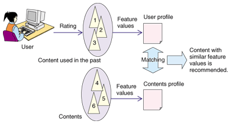
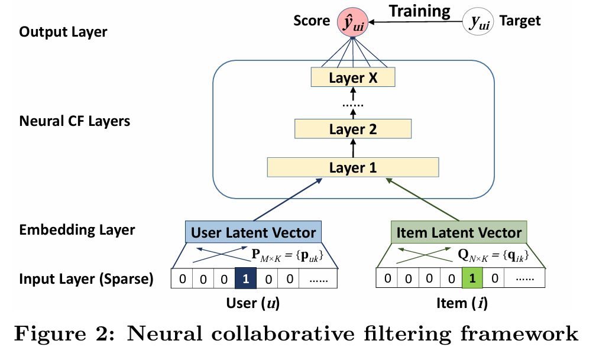
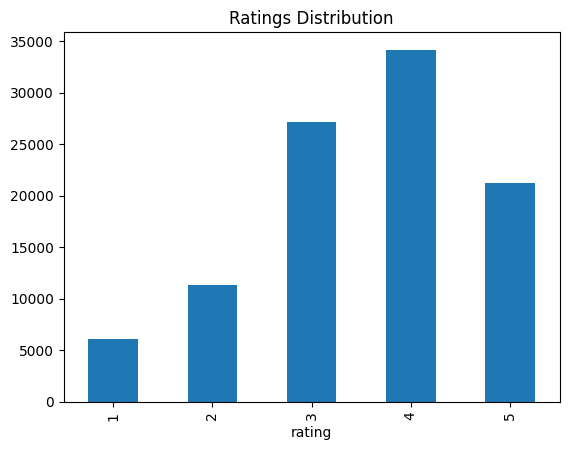
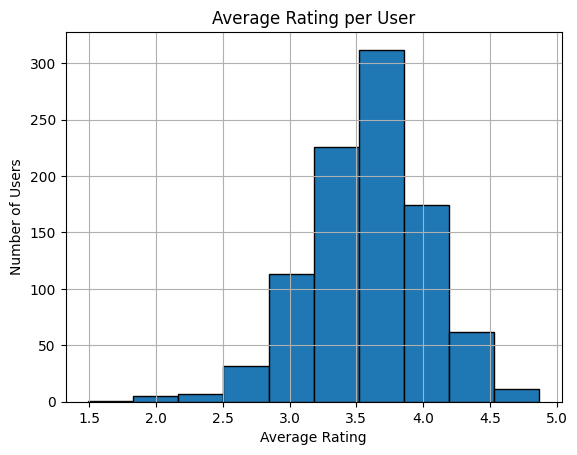
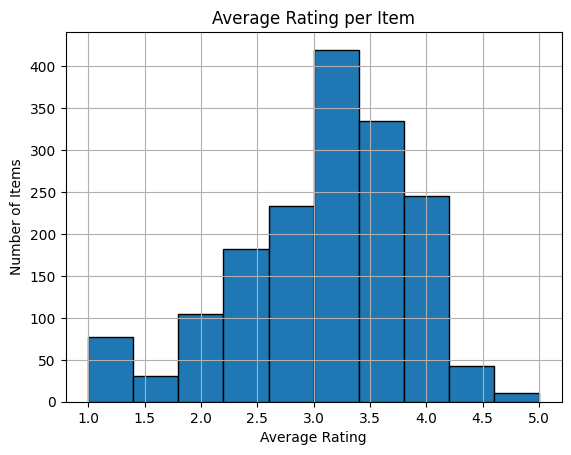
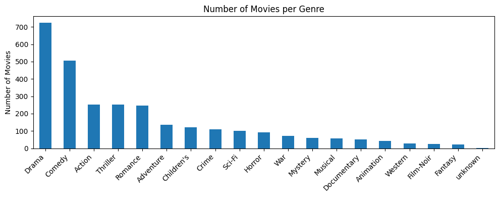
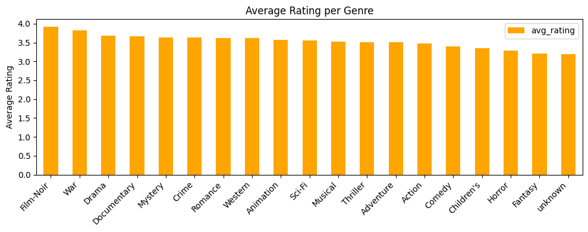
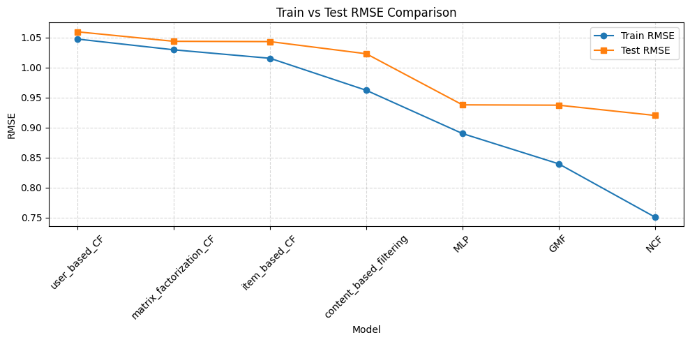

# Recommendation System on MovieLens dataset
## Project Overview
This project builds some classic and modern recommendation algorithms from scratch. The main objective is to have a better understanding of how different recommendation systems work and to compare their performance on the [MovieLens dataset](https://grouplens.org/datasets/movielens/).

The implemented methods include:
- Content-Based Filtering: Recommends items similar to those the user liked in the past based on item features.
- Neighborhood-Based Collaborative Filtering: Predicts user preferences by looking at similar users (user-user) or similar items (item-item).
- Matrix Factorization: Decomposes the user-item interaction matrix into lower-dimensional matrices to capture latent features.
- Neural Collaborative Filtering (NCF): Combines Generalized Matrix Factorization (GMF) and Multi-Layer Perceptron (MLP) for a more expressive model, which can learn complex, non-linear user-item relations. [<a href="#ref1">1</a>]

## Table of Contents
- [Recommendation System on MovieLens dataset](#recommendation-system-on-movielens-dataset)
  - [Project Overview](#project-overview)
  - [Table of Contents](#table-of-contents)
  - [Recommendation System](#recommendation-system)
    - [Content-Based Filtering](#content-based-filtering)
    - [Collaborative Filtering](#collaborative-filtering)
    - [Deep Learning-based RS](#deep-learning-based-rs)
  - [Dataset](#dataset)
    - [Objective](#objective)
    - [Data Exploration](#data-exploration)
  - [Model Evaluation](#model-evaluation)
  - [Future Work](#future-work)
  - [References](#references)

## Recommendation System
A recommendation system (RS) is a system that aim to predict the interaction between users and items. The interaction can be in the form of ratings, clicks, purchases, etc. For example, in case of MovieLens dataset, the recommendation system predicts the rating a user would give to a movie.

There are two main types of recommendation systems: content-based filtering, collaborative filtering. In this project, we have implemented some recommendation systems of both types.

### Content-Based Filtering
Content-based filtering (CBF) recommends items similar to those the user liked in the past. The similarity between items is calculated based on their features (e.g., genre, director, origin). Example: If a user watched many action movies, recommend more action films.

The CBF is a type of personalized recommendation system that utizies the explicit feature of items. However, it faces problems such as: computational cost (increseasing quadratically or cubically with the number of items), and a lack of item features.

\
*Source:* [Blog](https://findoutyourfavorite.blogspot.com/2012/04/content-based-filtering.html)

The implementation of CBF can be found in [src/content_based_recsys.py](src/content_based_recsys.py). 

### Collaborative Filtering
Collaborative filtering (CF) is a technique that predict the preferences of a user
 based on the preferences of similar other users or the preferences of the same user on similar items. Example: Recommend items liked by other users who have similar ratings or behavior. 

 Some example of collaborative filtering are:
 - Memory-based CF: Neighbourhood-based CF (User-based CF, Item-based CF). These methods evaluate the similarity between users or items based on the given ratings.
 - Model-based CF: Matrix factorization.  These methods learn latent factors representing user preferences and item characteristics. These methods decompose the
 user-item interaction matrix into latent feature vectors for users and items 

Some challenges: computational complexity and limited interpretability (which means it is hard to understand the reason behind the recommendation).

The implementation of Neighbourhood-based CF can be found in [src/NBCF.py](src/NBCF.py). The implementation of matrix factorization can be found in [src/matrix_factorization_CF.py](src/matrix_factorization_CF.py). 

### Deep Learning-based RS
Traditional RS primarily use linear models like matrix factorization, which is hard to learn non-linear relationships. Deep learning-based RS leverage deep layers to learn complex, non-linear user-item interactions. Example: Neural Collaborative Filtering, Deep Factorization Machines.

 \
*Source:* [1]

The implementation of NCF can be found in [src/NCF.py](src/NCF.py). 

## Dataset 
This project uses the [MovieLens dataset](https://grouplens.org/datasets/movielens/) 100k dataset, a benchmark dataset widely used in academic research for evaluating recommender systems.
- Contains 100,000 ratings (1–5 stars) from 943 users on 1682 movies.
- Data is split into five folds using the provided `u1.base`, `u1.test`, ..., `u5.base`, `u5.test` format for cross-validation.

All models in this project are evaluated across these five splits for consistency and fair comparison.

### Objective
The aim of recommendation systems is to predict the rating a user would give to an item they haven't rated yet. 

### Data Exploration
Data has been loaded into dataframes using pandas. It had three main columns: user_id, item_id, and rating. It had been analyezed and visulaized to gain insights before building the models. The details can be seen in [src/data_exploration.ipynb](src/data_exploration.ipynb). The following are some of the key observations:

- The distribution of ratings is not uniform, with a higher concentration of ratings around the middle values (3-4).

- Sparsity of the dataset: 0.937. The user-item interaction matrix is sparse, with many users rating only a few items. This sparsity can affect the performance of recommendation systems.
- Average rating per user: The average ratings per user is around 3.5-4.0.

- Average rating per item: The average ratings per item is around 3-3.5.

- Genre of movies: Movies are categorized into different genres. The most common genres are Drama, Comedy, and Action.

- Average ratings per genre: The average ratings is quiet uniform across genres.

## Model Evaluation
We evaluate the models using Root Mean Square Error (RMSE). It measures the average error between predicted and actual ratings. A lower RMSE indicates better performance. The RMSE is calculated using the following formula:
$$RMSE = \sqrt{\frac{1}{n} \sum_{i=1}^{n} (y_i - \hat{y}_i)^2}$$
where $y_i$ is the actual rating, $\hat{y}_i$ is the predicted rating, and $n$ is the number of ratings.

The experiments are conducted on the MovieLens 100k dataset, and the results are summarized in the table below:

| Model                   | Train RMSE | Test RMSE |
|-------------------------|------------|-----------|
| user_based_CF           | 1.0474     | 1.0595    |
| matrix_factorization_CF | 1.0296     | 1.0437    |
| item_based_CF           | 1.0154     | 1.0432    |
| content_based_filtering | 0.9621     | 1.0230    |
| MLP                     | 0.8901     | 0.9379    |
| GMF                     | 0.8397     | 0.9374    |
| NCF                     | 0.7511     | 0.9203    |

The details of the experiments can be found in [src/experiments.ipynb](src/experiments.ipynb).

The results show that NCF outperforms the other models in terms of RMSE. Other deep learning-based models like GMF and MLP also perform better than content-based filtering, neibourhood-based CF and matrix factorization. This indicates that deep learning-based models generalizes better to unseen data. This reusult is likely due to their ability to capture non-linear user-item interactions as compared to traditional methods.

## Future Work
In the future, I plan to implement some state-of-the-art recommendation systems utilizing graph learning techniques (e.g., [<a href="#ref2">2</a>]) or transformers. These approaches have shown promising results in recent research and could further enhance the performance of recommendation systems.

## References
[1] Xiangnan He, Lizi Liao, Hanwang Zhang, Liqiang Nie, Xia Hu, and Tat-Seng Chua. 2017. Neural Collaborative Filtering. In Proceedings of the 26th International Conference on World Wide Web (WWW '17). International World Wide Web Conferences Steering Committee, Republic and Canton of Geneva, CHE, 173–182. https://doi.org/10.1145/3038912.3052569

[2] Zhang, M., & Chen, Y. (2019). Inductive matrix completion based on graph neural networks. arXiv preprint arXiv:1904.12058. https://doi.org/10.48550/arXiv.1904.12058

